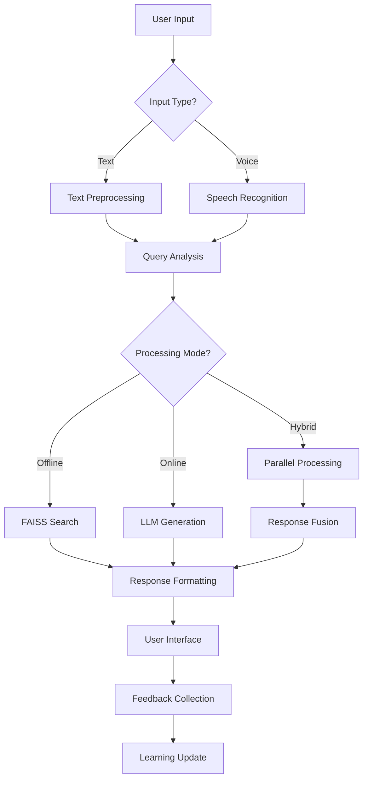

# 🏗️ KrishiSahay Technical Architecture

## System Overview

KrishiSahay employs a sophisticated multi-layered architecture combining traditional web technologies with cutting-edge AI capabilities to deliver intelligent agricultural assistance.

```
┌─────────────────────────────────────────────────────────────┐
│                    PRESENTATION LAYER                       │
├─────────────────────────────────────────────────────────────┤
│  Frontend (HTML/CSS/JS)  │  Streamlit Dashboard (Python)   │
│  • Interactive Chat UI   │  • Admin Interface              │
│  • Voice Recognition     │  • Analytics Dashboard          │
│  • Real-time Updates     │  • System Monitoring            │
└─────────────────────────────────────────────────────────────┘
                                │
                                ▼
┌─────────────────────────────────────────────────────────────┐
│                    APPLICATION LAYER                        │
├─────────────────────────────────────────────────────────────┤
│  Express.js API Server   │  Python Backend Services        │
│  • Query Processing      │  • AI Model Management          │
│  • Response Formatting   │  • Vector Operations             │
│  • Session Management    │  • Data Pipeline Control        │
└─────────────────────────────────────────────────────────────┘
                                │
                                ▼
┌─────────────────────────────────────────────────────────────┐
│                      AI INTELLIGENCE LAYER                  │
├─────────────────────────────────────────────────────────────┤
│  IBM Watsonx Granite LLM │  FAISS Vector Database          │
│  • Natural Language Gen  │  • Semantic Search               │
│  • Context Understanding │  • Similarity Matching          │
│  • Response Enhancement  │  • Fast Retrieval                │
└─────────────────────────────────────────────────────────────┘
                                │
                                ▼
┌─────────────────────────────────────────────────────────────┐
│                       DATA LAYER                            │
├─────────────────────────────────────────────────────────────┤
│  Agricultural Knowledge  │  Vector Embeddings               │
│  • KCC Dataset          │  • Sentence Transformers         │
│  • Crop Information     │  • Semantic Representations      │
│  • Expert Knowledge     │  • Indexed Vectors               │
└─────────────────────────────────────────────────────────────┘
```

## 🔄 Data Processing Pipeline

### Stage 1: Data Ingestion & Preprocessing
```python
Raw KCC Data → Cleaning → Validation → Standardization → Storage
     │              │           │             │            │
     ▼              ▼           ▼             ▼            ▼
CSV Files    Remove Nulls   Check Format   Normalize    JSON/CSV
Excel Data   Deduplicate    Validate Q&A   Text Clean   Database
Text Files   Fix Encoding   Language Det   Tokenize     Backup
```

### Stage 2: Embedding Generation Pipeline
```python
Preprocessed Data → Sentence Transformer → Vector Generation → Optimization
        │                    │                    │              │
        ▼                    ▼                    ▼              ▼
   Clean Text         all-MiniLM-L6-v2      384-dim vectors   Normalize
   Q&A Pairs          Model Loading         Batch Processing  Quantization
   Metadata           GPU Acceleration      Memory Efficient  Compression
```

### Stage 3: Vector Indexing & Storage
```python
Embeddings → FAISS Index → Optimization → Persistence → Validation
     │            │            │             │            │
     ▼            ▼            ▼             ▼            ▼
Float32 Array  IndexFlatL2   Add Vectors   Save Binary  Test Queries
Batch Load     Index Build   Clustering    Metadata     Performance
Memory Map     GPU Support   Quantization  Backup       Accuracy
```

### Stage 4: Query Processing Pipeline
```python
User Query → Preprocessing → Embedding → FAISS Search → Response Generation
     │            │             │           │              │
     ▼            ▼             ▼           ▼              ▼
Text Input   Clean/Normalize  Vectorize   Top-K Search   Format Output
Voice Input  Language Detect  Transform   Similarity     Rank Results
Context      Spell Check      Encode      Distance       Combine Sources
```

## 📁 Dynamic File Structure

```
krishisahay/
├── 🎨 frontend/                          # Modern Web Interface
│   ├── public/
│   │   ├── index.html                    # Main UI with animations
│   │   ├── styles.css                    # Unique gradient design
│   │   ├── script.js                     # Interactive functionality
│   │   └── assets/
│   │       ├── icons/                    # Custom agricultural icons
│   │       ├── sounds/                   # UI feedback sounds
│   │       └── animations/               # Lottie animations
│   ├── server.js                         # Express API server
│   └── package.json                      # Node.js dependencies
│
├── 🧠 ai-backend/                        # Python AI Services
│   ├── core/
│   │   ├── __init__.py
│   │   ├── query_handler.py              # FAISS query processing
│   │   ├── granite_llm.py                # IBM Watsonx integration
│   │   ├── embedding_engine.py           # Vector generation
│   │   └── response_formatter.py         # Output formatting
│   │
│   ├── pipeline/
│   │   ├── __init__.py
│   │   ├── data_preprocessing.py         # Stage 1: Data cleaning
│   │   ├── generate_embeddings.py        # Stage 2: Vector creation
│   │   ├── create_faiss_index.py         # Stage 3: Index building
│   │   └── pipeline_orchestrator.py      # Workflow management
│   │
│   ├── models/
│   │   ├── __init__.py
│   │   ├── sentence_transformer.py       # Embedding model wrapper
│   │   ├── granite_client.py             # LLM client
│   │   └── model_manager.py              # Model lifecycle
│   │
│   ├── utils/
│   │   ├── __init__.py
│   │   ├── config.py                     # Configuration management
│   │   ├── logger.py                     # Structured logging
│   │   ├── metrics.py                    # Performance monitoring
│   │   └── validators.py                 # Data validation
│   │
│   ├── app.py                            # Streamlit dashboard
│   ├── setup.py                          # Automated setup
│   └── requirements.txt                  # Python dependencies
│
├── 📊 data/                              # Data Storage Layer
│   ├── raw/
│   │   ├── raw_kcc.csv                   # Original dataset
│   │   ├── expert_knowledge.json         # Curated expertise
│   │   └── government_schemes.yaml       # Policy information
│   │
│   ├── processed/
│   │   ├── clean_kcc.csv                 # Cleaned dataset
│   │   ├── kcc_qa_pairs.json             # Structured Q&A
│   │   └── metadata.json                 # Data statistics
│   │
│   ├── embeddings/
│   │   ├── kcc_embeddings.pkl            # Vector representations
│   │   ├── embedding_metadata.json       # Vector information
│   │   └── model_info.json               # Model details
│   │
│   ├── indices/
│   │   ├── faiss_index.bin               # FAISS binary index
│   │   ├── meta.pkl                      # Index metadata
│   │   └── index_config.json             # Index parameters
│   │
│   └── cache/
│       ├── query_cache.db                # Cached responses
│       ├── embedding_cache.pkl           # Cached embeddings
│       └── model_cache/                  # Model artifacts
│
├── 🔧 config/                            # Configuration Management
│   ├── development.env                   # Dev environment
│   ├── production.env                    # Prod environment
│   ├── model_config.yaml                 # AI model settings
│   └── pipeline_config.json              # Processing parameters
│
├── 📋 tests/                             # Comprehensive Testing
│   ├── unit/
│   │   ├── test_query_handler.py
│   │   ├── test_embedding_engine.py
│   │   └── test_granite_llm.py
│   │
│   ├── integration/
│   │   ├── test_pipeline.py
│   │   ├── test_api_endpoints.py
│   │   └── test_ui_functionality.py
│   │
│   ├── performance/
│   │   ├── benchmark_queries.py
│   │   ├── load_testing.py
│   │   └── memory_profiling.py
│   │
│   └── fixtures/
│       ├── sample_queries.json
│       ├── expected_responses.json
│       └── test_data.csv
│
├── 📚 docs/                              # Documentation
│   ├── API_REFERENCE.md                  # API documentation
│   ├── DEPLOYMENT_GUIDE.md               # Deployment instructions
│   ├── DEVELOPMENT_SETUP.md              # Developer guide
│   ├── USER_MANUAL.md                    # End-user documentation
│   └── TROUBLESHOOTING.md                # Common issues
│
├── 🚀 deployment/                        # Deployment Configurations
│   ├── docker/
│   │   ├── Dockerfile.frontend
│   │   ├── Dockerfile.backend
│   │   └── docker-compose.yml
│   │
│   ├── kubernetes/
│   │   ├── frontend-deployment.yaml
│   │   ├── backend-deployment.yaml
│   │   └── service-configs.yaml
│   │
│   └── scripts/
│       ├── deploy.sh                     # Deployment script
│       ├── backup.sh                     # Data backup
│       └── monitor.sh                    # Health monitoring
│
├── 📊 monitoring/                        # System Monitoring
│   ├── logs/
│   │   ├── application.log
│   │   ├── error.log
│   │   └── performance.log
│   │
│   ├── metrics/
│   │   ├── query_analytics.json
│   │   ├── response_times.csv
│   │   └── user_interactions.db
│   │
│   └── dashboards/
│       ├── grafana_config.json
│       ├── prometheus_rules.yml
│       └── alerting_rules.yml
│
├── .env                                  # Environment variables
├── .gitignore                           # Git ignore rules
├── README.md                            # Project overview
├── ARCHITECTURE.md                      # This file
└── LICENSE                              # MIT License
```

## 🤖 Dynamic AI Components

### 1. Adaptive Query Understanding
```python
class DynamicQueryProcessor:
    def __init__(self):
        self.context_memory = {}
        self.user_patterns = {}
        self.domain_classifier = CropDomainClassifier()
    
    def process_query(self, query, user_id=None):
        # Context-aware processing
        context = self.get_user_context(user_id)
        
        # Domain classification
        domain = self.domain_classifier.classify(query)
        
        # Intent recognition
        intent = self.extract_intent(query, context)
        
        # Dynamic response routing
        return self.route_to_specialist(query, domain, intent)
```

### 2. Multi-Modal Response Generation
```python
class ResponseOrchestrator:
    def __init__(self):
        self.offline_engine = FAISSSearchEngine()
        self.online_engine = GraniteLLMEngine()
        self.fusion_layer = ResponseFusionLayer()
    
    def generate_response(self, query, mode='hybrid'):
        responses = {}
        
        # Parallel processing
        if mode in ['offline', 'hybrid']:
            responses['offline'] = self.offline_engine.search(query)
        
        if mode in ['online', 'hybrid']:
            responses['online'] = self.online_engine.generate(query)
        
        # Intelligent fusion
        return self.fusion_layer.combine(responses, query)
```

### 3. Continuous Learning Pipeline
```python
class ContinuousLearningSystem:
    def __init__(self):
        self.feedback_collector = FeedbackCollector()
        self.model_updater = ModelUpdater()
        self.performance_monitor = PerformanceMonitor()
    
    def learn_from_interactions(self):
        # Collect user feedback
        feedback = self.feedback_collector.get_recent_feedback()
        
        # Update embeddings
        if self.should_update_embeddings(feedback):
            self.update_vector_space(feedback)
        
        # Retrain models
        if self.should_retrain_models(feedback):
            self.model_updater.incremental_training(feedback)
```

## 🔄 Real-Time Processing Flow

### Query Lifecycle


## 🎯 Performance Optimizations

### 1. Caching Strategy
- **Query Cache**: LRU cache for frequent queries
- **Embedding Cache**: Pre-computed vectors for common terms
- **Response Cache**: Cached AI responses for identical queries

### 2. Parallel Processing
- **Async Operations**: Non-blocking I/O operations
- **Multi-threading**: Parallel embedding generation
- **GPU Acceleration**: CUDA support for vector operations

### 3. Memory Management
- **Lazy Loading**: Load models on demand
- **Memory Mapping**: Efficient file access
- **Garbage Collection**: Automatic cleanup

## 🔒 Security & Privacy

### Data Protection
- **Encryption**: AES-256 for data at rest
- **Secure Transmission**: HTTPS/TLS for API calls
- **Access Control**: Role-based permissions

### Privacy Measures
- **Data Anonymization**: Remove PII from queries
- **Local Processing**: Offline mode for sensitive data
- **Audit Logging**: Track all data access

## 📈 Scalability Architecture

### Horizontal Scaling
- **Load Balancing**: Distribute queries across instances
- **Microservices**: Independent service scaling
- **Container Orchestration**: Kubernetes deployment

### Vertical Scaling
- **Resource Optimization**: Dynamic resource allocation
- **Model Compression**: Quantized models for efficiency
- **Index Optimization**: Compressed FAISS indices

This architecture ensures KrishiSahay can handle growing user demands while maintaining high performance and accuracy in agricultural query resolution.